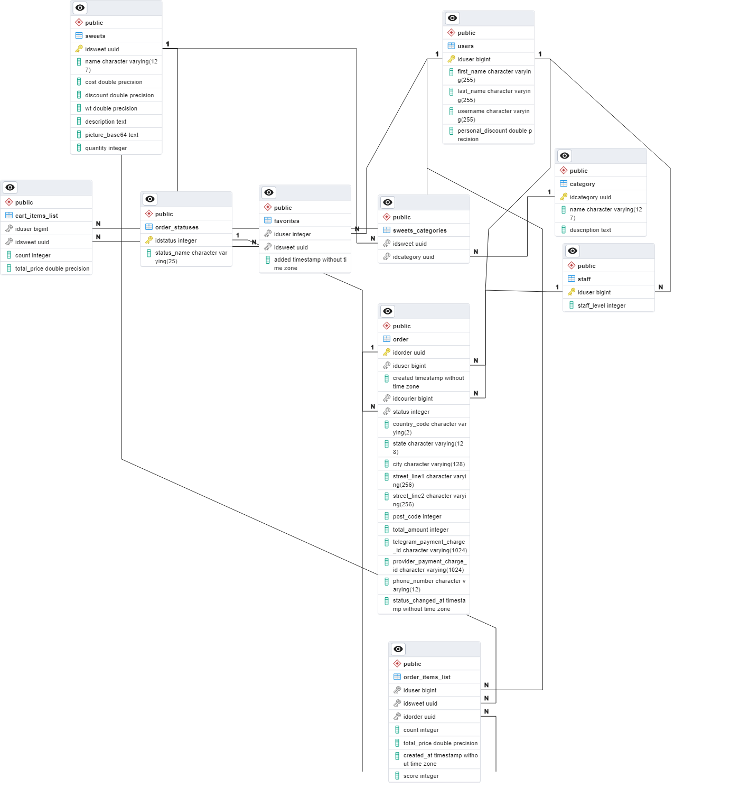

[На русском](readme_ru.md)
# Mini Sweet Shop App for Telegram
## 📖 Introduction
This application was developed using the Express web server and PostgreSQL database management system (in addition to tables, views, and functions were developed to facilitate database operations).
The application includes: a main web page for the user to browse the store, a table editor for the store administrator, and some logic for store couriers.
The application was developed for Vercel, which is why all JavaScript files are located in the `api` folder.

## 🤖 Creating a Bot
To use the mini-application, you need to create a Telegram bot. To do this, start a chat with [@BotFather](https://t.me/BotFather) and send the command /newbot. Then, give your bot a name (for example, Delivery Products) and specify a @username for the bot, which users can use to find it. The username should end with "bot." If the username is already taken, please try another one. After successfully creating the bot, you will be provided with a bot token. This token is secret and should not be shared with anyone. Copy this token and save it in your `.env` file.

To accept payments, you will need to obtain a payment token. To get one, send the command /mybots to [@BotFather](https://t.me/BotFather) to see a list of your created bots. Select your bot, click on "Payments," and choose a payment provider. You will be redirected to another bot that will provide you with a token. This token will also appear in [@BotFather](https://t.me/BotFather). Copy the payment token and specify it in your `.env` file.

With that, the basic bot setup is complete.

*Couriers* receive a list of active orders through inline search. To enable this feature, you need to activate it using [@BotFather](https://t.me/BotFather). To do so, select your bot in `/mybots` and go to Bot Settings > Inline Mode > Turn on.

You can also choose the message that will be displayed to users when they use the inline mode. Please note that the message will be visible to all bot users, not just couriers. Therefore, it's advisable to write something neutral, for example, "...".

You can obtain the values for `EDITOR_ID` and `ADMINS_CHAT_ID`, for example, using the web version of Telegram. The IDs will be visible in the address bar when you select chats.

### Bot Functionality (Briefly)
The bot provides access to different mini-apps based on the user's role. Customers gain access after sending the `/start` command, couriers with `/courier`, and administrators (editors) with `/editor`. The courier mode is only available to users listed in the "staff" table (automatic addition occurs after adding new users to the group with ID == `ADMINS_CHAT_ID`). The editing mode is available only to the user whose ID is specified in the `EDITOR_ID` variable.

Customers can browse products, switch categories, and like items.

The store offers discounts on each product individually and personally for each user. Currently, I've set it up so that discounts are cumulative. After successful payment, couriers receive a notification in the `ADMINS_CHAT_ID` group about a new order. Couriers can accept orders through the inline menu or via the mini-app. Whenever there is a change in the order status, the customer receives a notification. Status changes can only occur incrementally, meaning you can't accept an order and immediately complete it; status changes must be sequential. Once the courier completes the order, the customer can rate all the items in the order from ⭐×1 to ⭐×5, which will later influence their positioning in the "Recommendations" section.

Store editors can add or remove product categories, modify them, and assign discounts per product or to individual users.

## ⚙️ Installation
### Dependencies
To ensure the proper functioning of this project, you will need to install [Node.js](https://nodejs.org/en) and the npm package manager.

After installation, open the folder containing the cloned repository using Visual Studio Code or any other text editor of your choice.

The project relies on third-party packages for its operation:

* axios - for sending requests (Telegram Bot API),
* express - for the web server,
* body-parser - a helper package for express to parse request bodies,
* cors - a helper package for express to handle [CORS](https://en.wikipedia.org/wiki/Cross-origin_resource_sharing). You may skip this if your application does not require CORS requests,
* pg - for database connection and executing queries.

In the console, run the following commands to install the dependencies:
```bash
npm i axios
npm i express
npm i body-parser
npm i cors
npm i pg
```

### Deployment on Vercel
If you want to host this project on Vercel, run the following command:
```bash
npm i -g vercel
```
After that, you can deploy the project to Vercel using the following command:
```bash
vercel --prod
```
Once the application is deployed, you will receive a URL that needs to be filled in your configuration. You can also add your custom domain by going to your project's properties > Domains.

## 📦 Database
The tables, views, and functions in this project are designed for PostgreSQL database management system (DBMS).

To create tables, views, and functions, you will need to connect to your PostgreSQL database using a method that is convenient for you. One of the most convenient ways may be to connect using [pgAdmin](https://www.pgadmin.org/).

To connect to the DB server using pgAdmin, open it and right-click on "Servers," then select "Register > Server." In the window that appears, enter all the connection details: server address, username, password, and database name.

After saving and successfully connecting, you will see your database in the list. Right-click on it and choose "Query Tool." In the Query Tool, sequentially paste the contents of the files `tables.sql`, `functions.sql`, and `views.sql`, located in the `sql` folder of this repository, and click on "Execute/Refresh" (▶️ button at the top) or press the F5 key. Afterward, you can add test data from `examples.sql`.

### Tables

### Views
The following views are implemented in the database:
* active_orders_v - displays all unfinished orders
* available_to_leave_feedback_v - shows a list of products that can be rated; these are all products from completed orders
* admins_v - a list of couriers and system administrators
* cart_v - user shopping carts
* sweets_v - all products
* categories_v - all categories
* sweets_categories_list_v - product-category pairs; if a product belongs to multiple categories, there will be multiple pairs for each category
* users_v - a list of all users who interacted with the bot, including couriers and administrators
* recommendations_v - a list of recommended products
* sweets_and_categories_v - similar to sweets_categories_list_v, but with complete product information
* likes_v - products that users added to their favorites

### Functions
These functions are implemented on the database side and are called through functions stored in the `databaseworker.js` file. In this file, wrappers for these functions are stored.

| #  | Name                              | Function/View | Arguments                                                                                   | Calling Function in databaseworker.js | Purpose                                                                          |
| -- | --------------------------------- | - | ------------------------------------------------------------------------------------------- | ------------------------------- | -------------------------------------------------------------------------------- |
| 1  | user_create_or_update             | F | id, first_name, last_name, username                                                        | CreateOrUpdateUser             | Adding or updating user information                                           |
| 2  | category_create                   | F | name, description                                                                            | CreateCategory                 | Creating a category                                                            |
| 3  | order_update_payment_charge       | F | telegram_payment_charge_id, provider_payment_charge_id, orderid                              | ConfirmPayment                 | Confirming payment (OnSuccessfulPayment)                                        |
| 4  | cart_items_getuser                | F | userid                                                                                       | GetCart                        | Get user's cart                                                                |
| 5  | order_create                      | F | userid                                                                                       | CreateOrder                    | Create an order                                                                |
| 6  | order_getid_byuserid              | F | userid                                                                                       | GetUserLastOrderId             | Get the last order for a user                                                  |
| 7  | order_update_address              | F | orderid, country_code, state, city, street_line1, street_line2, post_code, phone_number      | SetOrderAdress                 | Update order address                                                           |
| 8  | staff_create                      | F | userid, staff_level                                                                          | AddStaff                       | Add a courier                                                                  |
| 9  | staff_remove                      | F | userid                                                                                       | RemoveStaff                    | Remove a courier                                                               |
| 10 | staff_check                       | F | userid                                                                                       | IsAdmin                        | Check if a user is a courier                                                   |
| 11 | admins_v                          | V | -                                                                                           | GetAdmins                      | Get couriers and administrators                                                |
| 12 | sweets_getall                     | F | userid                                                                                       | GetSweets                      | Get a list of all products, considering user likes                              |
| 13 | sweets_v                          | V | -                                                                                           | GetSweets                      | Get a list of all products                                                     |
| 14 | likes_v_getsweets                 | F | userid                                                                                       | GetSweets                      | Get a list of liked products by a user                                         |
| 15 | get_recommendations               | F | userid                                                                                       | GetSweets                      | Get a list of recommendations for a user, considering likes                      |
| 16 | sweets_and_categories_v_getsweets | F | categoryid, userid                                                                           | GetSweets                      | Get a list of products by category                                             |
| 17 | cart_add                          | F | idsweet, iduser, count                                                                       | AddToCart                      | Add to cart                                                                    |
| 18 | categories_v                      | V | -                                                                                           | GetAllCategories               | Get a list of available categories                                             |
| 19 | orders_get_available              | F | idcourier                                                                                    | GetAvailableOrders             | Get a list of orders available to a courier                                    |
| 20 | order_update_status               | F | idorder, idcourier, statusNew                                                                | UpdateOrderStatus              | Update order status. The difference between statuses should not be more than one |
| 21 | get_available_feedbacks           | F | iduser                                                                                       | GetAvailableFeedbacks          | Get a list of products available for user feedback                              |
| 22 | order_items_list_update_score     | F | iduser, idsweet, score                                                                       | UpdateScore                    | Rate a product by a user                                                       |
| 23 | favorite_add                      | F | idsweet, iduser                                                                              | AddToFavorites                 | Add to favorites. If already there - then remove it                             |
| 24 | sweet_create                      | F | name, cost, discount, wt, description, picture_base64, quantity, categories                  | CreateSweet                    | Create a new confectionery product                                             |
| 25 | sweets_categories_list_v          | V | -                                                                                           | GetCategoriesAndSweets         | Get a list of products with their categories                                   |
| 26 | categories_list_add               | F | idsweet, idcategory                                                                          | AddCategoryToSweet             | Add a category to a product                                                    |
| 27 | categories_list_remove            | F | idsweet, idcategory                                                                          | RemoveCategoryFromSweet        | Remove a category from a product                                               |
| 28 | sweets_update                     | F | idsweet, cost, discount, quantity                                                            | UpdateSweet                    | Update product information                                                     |
| 29 | sweets_remove                     | F | idsweet                                                                                      | RemoveSweet                    | Delete (mark only) a product                                                   |
| 30 | category_update                   | F | id, name, description                                                                        | UpdateCategory                  | Update category information                                                    |
| 31 | category_delete                   | F | id                                                                                          | DeleteCategory                  | Delete a category (mark only)                                                  |
| 32 | users_v                           | V | -                                                                                           | GetUsers                        | Get a list of users                                                            |
| 33 | user_update_discount              | F | iduser, discount                                                                             | UpdateDiscount                  | Update user discount (from 0 to 0.9)                                           |

*P.S. If I missed something while separating tables, functions, and views into separate files, please check the full.sql file.*

## 🔌 API Interaction
API call processing is handled by the index.js and bot.js files. bot.js works with the virtual /bot directory, while index.js handles /api (customer part), /admin-api (editor), and /courier-api (courier part).

To accommodate this, you need to create redirects for these directories to their respective files.

If you are using Vercel, your vercel.json file should look like this:

```json
{
    "rewrites": [
        {
            "source": "/api/(.*)",
            "destination": "/api/index.js"
        },
        {
            "source": "/admin-api/(.*)",
            "destination": "/api/index.js"
        },
        {
            "source": "/courier-api/(.*)",
            "destination": "/api/index.js"
        },
        {
            "source": "/bot",
            "destination": "/api/bot.js"
        }
        ...
    ]
}
```
The following functions are called via the `/api/:type` endpoint:
| :type | Called Function  | Arguments                |
|--------------|----------------------------------------|------------------------------------------|
| "sweets"     | GetSweets("", user.id)               | Depending on the presence of `idcategory`  |
|              | GetSweets(request.query.idcategory, user.id)|                                      |
| "categories" | GetAllCategories()                   | None                                      |
| "invoice"    | CreateInvoiceLink(user, prices)      | None                                      |
| "add_cart"   | AddToCart(idssweet, user.id, counts) | `idssweet`, `user.id`, `counts`           |
| "like"       | AddToFavorites(request.body.idsweet, user.id) | `request.body.idsweet`, `user.id`  |

The following functions are called via the `/admin-api/:type` endpoint:
| :type | Called Function  | Arguments                |
|--------------|----------------------------------------|------------------------------------------|
| "getcategories" | GetAllCategories()               | None                                      |
| "addsweet"      | CreateSweet()                    | name, cost, discount, wt, description, picture_base64, quantity, categories |
| "createcategory" | CreateCategory()                | name, description                         |
| "sw_category_add" | AddCategoryToSweet()           | idsweet, idcategory                       |
| "sw_category_remove" | RemoveCategoryFromSweet() | idsweet, idcategory                       |
| "updatesweet" | UpdateSweet()                    | idsweet, cost, discount, quantity          |
| "updatecategory" | UpdateCategory()                | id, name, description                     |
| "updatediscount" | UpdateDiscount()                | iduser, discount                          |
| "deletesweet" | RemoveSweet()                    | idsweet                                   |
| "deletecategory" | DeleteCategory()                | id                                        |

The following functions are called via the `/courier-api/:type` endpoint:
| :type  | Called Function  | Arguments                                |
|----------------------|-----------------------|------------------------------------------------------------|
| "getavailableorders" (GET) | GetAvailableOrders() | user.id     |
|------------------|-------------------|------------------------|
| "updatestatus" (POST)   | UpdateOrderStatus() | idorder, user.id, body.statusnew |

All arguments are passed either in the request body for POST requests or as GET parameters for GET requests. Additionally, `telegramInitData` is included in the query string after `:type`.

## 🗃️ Files
### index.js
Entry point.

To make the application work, incoming requests to `api/*` and `admin-api/*` need to be redirected to `index.js`.
Each request here is verified using the `verifyTelegramWebAppData` function (see below), and requests to `/admin-api` are checked for compliance with `EDITOR_ID` (see `secrets.js`).

### bot.js
Handler for the /bot directory, the webhook for the Telegram Bot API (if a POST request is received). Incoming requests are forwarded to the TelegramEventsHandlers.js file.

It also handles setting up the webhook for a specified domain (if accessed at your_domain/bot).

### TelegramEventsHandlers.js
Contains event handlers for messages, inline searches (when a courier searches for their order), button presses (when a courier changes the order status), pre-checkout query requests (`OnPrecheckoutQuery`), successful payment requests (`OnSuccessfulPayment`), invoice link creation (`CreateInvoiceLink`), adding/removing couriers when they join a group, and notifying couriers when an order is created (and successfully paid for).

### TelegramWebApp.js
Contains functions for validating `telegramInitData`. `telegramInitData` is considered valid when the provided and calculated hashes match and when the authorization time (`auth_date`) is not older than 24 hours.

### lightTeleAPI.js
Here, I have implemented my own wrappers for calling the necessary Telegram Bot API functions (`answerInlineQuery`, `sendMessage`, `sendSticker`, `editMessageText`, `answerCallbackQuery`, `deleteMessage`, `createInvoiceLink`, `answerPreCheckoutQuery`, `setWebhook`).

### databaseworker.js
This file contains wrappers for all the functions and views listed in the table above. 

All functions are called using `RunFunction(function_name, [argument_array])`, where a Prepared Statement is generated for them, and views are accessed using `SeeView(view_name)`.

### secrets.js
This file contains the following secrets:
* `BOT_TOKEN` - the bot token obtained through [@BotFather](https://t.me/BotFather).
* `PAYMENT_TOKEN` - the payment token.
* `EDITOR_ID` - the editor's ID (only this user can access editing).
* `ADMINS_GROUP_CHATID` - the ID of the group where notifications about new orders will be sent.

Other constants should be defined using the `.env` file (or through project settings > Environment Variables if you are using Vercel). These variables include:
* `PGHOST` - the database connection address.
* `PGDATABASE` - the database name.
* `PGUSER` - the username.
* `PGPASSWORD` - the password.

It's recommended to keep all your secret data in the `.env` file or similar, and not share them with anyone.

An example `.env` file might look like this:
```env
BOT_TOKEN="123456:ABC-DEF1234ghIkl-zyx57W2v1u123ew11"
PAYMENT_TOKEN="333556:GMASDawttypp"
EDITOR_ID="4255555"
ADMINS_GROUP_CHATID="-1295900"

PGHOST="pgsql.panci.to"
PGDATABASE="pancitos_examples_database"
PGUSER="seller"
PGPASSWORD="44442300058"
```

If you are using Vercel, Heroku, or similar solutions, you can set environment variables in your project's Settings > Environment Variables.

After specifying them in the .env file, the secrets.js file will look like this:
```js
const BOT_TOKEN = process.env.BOT_TOKEN;
const PAYMENT_TOKEN = process.env.PAYMENT_TOKEN;
const EDITOR_ID = process.env.EDITOR_ID;
const ADMINS_GROUP_CHATID = process.env.ADMINS_GROUP_CHATID;

...
```

### strings.js
In this file, texts of messages in various languages that are sent to the user are stored. The `DEFAULT_LANGCODE` variable stores the default language code that will be sent in case there are no strings available in the requested language. It is essential to have a string in this language, or else the user will receive `undefined`.

### vercel.json
This file is used to configure Vercel for this project. It specifies the redirection of requests to `index.js` and `bot.js`.

To enable access to static files, the following entries have been added:
```json
...
{
    "source": "/editor.js",
    "destination": "/editor/editor.js"
},
{
    "source": "/bootstrap.min_custom.css",
    "destination": "/app/bootstrap.min_custom.css"
},
{
    "source": "/app.js",
    "destination": "/app/app.js"
}
...
```

## app/index.html
This is the main page of the store, which contains some markup using Bootstrap. The generated HTML code for product cards will be added here by app.js.

Some CSS classes have been overridden using variables to customize the store interface to match the Telegram user theme.

In addition to Bootstrap, you need to include the jQuery library and the library for the Telegram Web App.

## app/app.js
This file contains all the logic for the mini-application: generating code for product cards, generating code for categories, handling button clicks to increase/decrease the quantity of added products, and liking/unliking products.

You need to change the `API_ENDPOINT` constant to specify the server address where requests will be sent. If you are hosting everything on the same server, specify the same address as you did in the `strings.js` file. Also, change `MIN_AMOUNT` and `MAX_AMOUNT` - these are the minimum and maximum amounts accepted by the payment provider for processing. You can find values for your currency [here](https://core.telegram.org/bots/payments/currencies.json).

Requests are sent to the domain specified in the `API_ENDPOINT` constant. Each request includes [telegramInitData](https://core.telegram.org/bots/webapps#webappinitdata) in the query string for verification.

## editor/index.html
The main page of the store editor. Similar to index.html for the user side.

## editor/editor.js
Logic for generating tables with products, tabs, and handling button clicks for editing/deleting.

Here, you can delete, edit, or add new products or categories, and change the discount for a user.

Requests are sent to the domain specified in the `API_ENDPOINT` constant with `telegramInitData` added to the query string.

## courier/index.html
Main page for the courier section. Similar to all other pages.

## courier/courier.js
Logic for generating the list of active orders. Each courier can only see their own unfinished and new orders.

Requests are sent to the domain specified in the `API_ENDPOINT` constant with the addition of `telegramInitData` in the query string.
